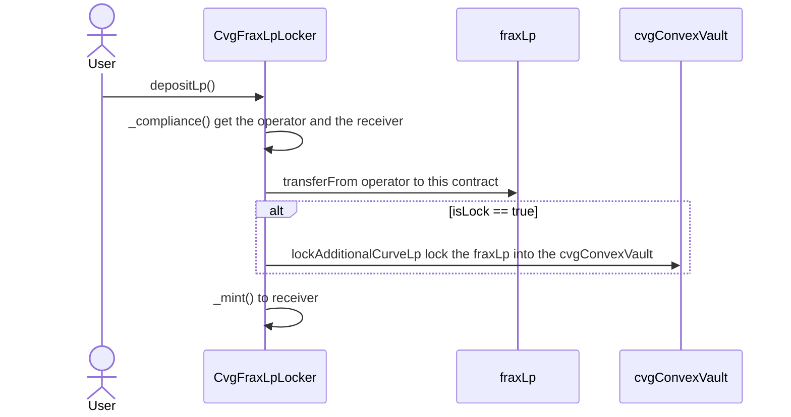
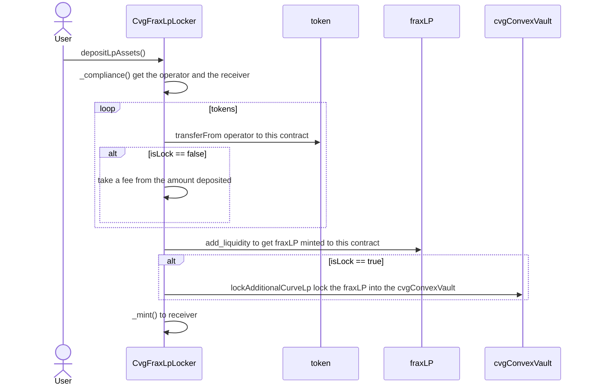
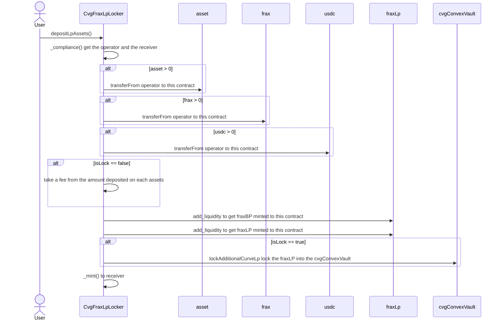
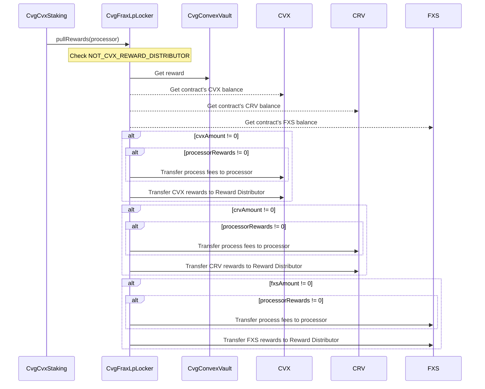

# CvgFraxLpLocker

## Description

This contract aims to cover 3 features of the Convex integration on Convergence.
First one is the ERC20 integration of our cvgFraxLp token which acts as a locker of convexFraxLp, which means that having 1 cvgFraxLp is the same as having 1 convexFraxLp.
An associated stable pool will allow stakers to retrieve their convexFraxLp at almost 1:1 ratio depending on the peg of the pool.

The second goal of this contract is to lock the convexFraxLp received during the minting of cvgFraxLp tokens into the associated ConvexVault.

Then, it acts as a Buffer to pull rewards earned through locking convexFraxLp.
Rewards are these three tokens: CVX, CRV, FXS

### depositLp

Callable by anyone or through his cvgFraxLpStaking contract, consist of deposit the fraxLp to get the cvgFraxLp erc20 token used as staked token.



### depositLpAssets

Callable by anyone or through his cvgFraxLpStaking contract, consist of deposit the fraxLP assets (asset+fraxBP) to get the cvgFraxLp erc20 token used as staked token.



### depositLpAssets

Callable by anyone or through its cvgFraxLpStaking contract, consists of depositing the fraxLP assets (asset+frax+usdc) to get the cvgFraxLp erc20 token used as staked token.



### increaseLock

Callable by anyone, consists to lock the pending fraxLP on the contract, from users that didn't locked directly.
The processor of this function will be rewarded by the pending fees (asset+fraxBP+frax+usdc) earned from others users.

```mermaid
sequenceDiagram
    actor User
    User->>increaseLock
    CvgFraxLpLocker->>fraxLp: balanceOf this contract
    note over CvgFraxLpLocker: Check NO_PENDING_LP
    CvgFraxLpLocker->>cvgConvexVault: lockAdditionalCurveLp lock the pending fraxLP into the cvgConvexVault
    CvgFraxLpLocker->>cvgConvexVault: lockLonger lock max time the staking position of this contract
    loop assets
        CvgFraxLpLocker->>asset: balanceOf this contract
        alt asset > 0
            CvgFraxLpLocker->>asset: transfer to msg.sender
        end
    end

    loop assetsUnderlying
        CvgFraxLpLocker->>assetUnderlying: balanceOf this contract
        alt asset > 0
            CvgFraxLpLocker->>assetUnderlying: transfer to msg.sender
        end
    end
```

### pullRewards

This method is called by the CvgFraxLp staking contract to pull the rewards into the Reward Distributor contract.
This process is encouraged so the user who triggers it through the staking contract receives rewards.


