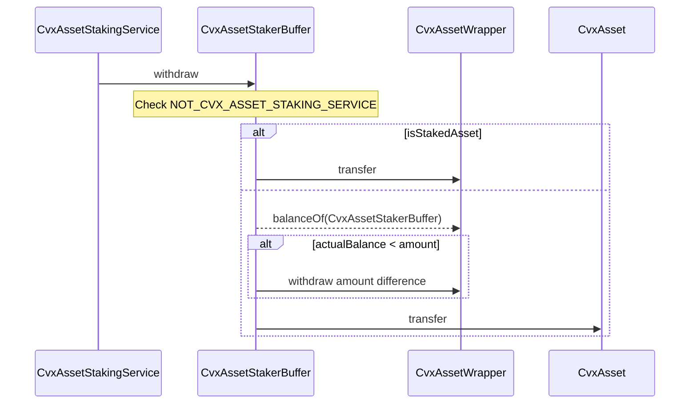
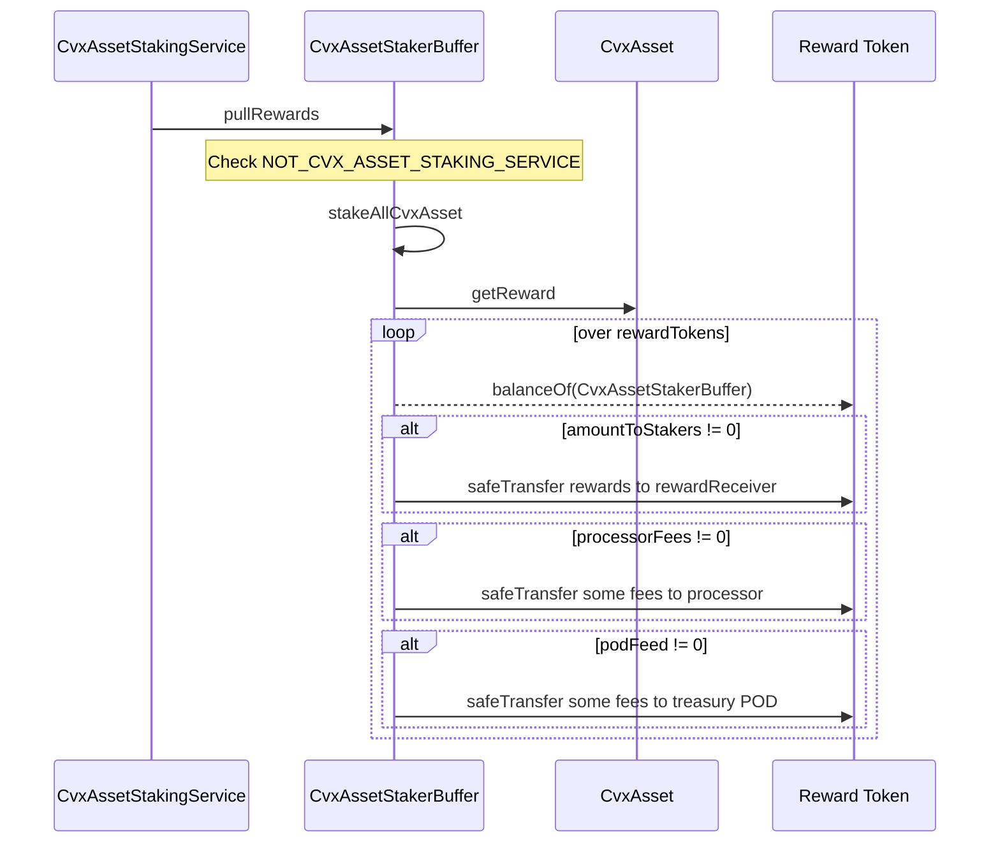
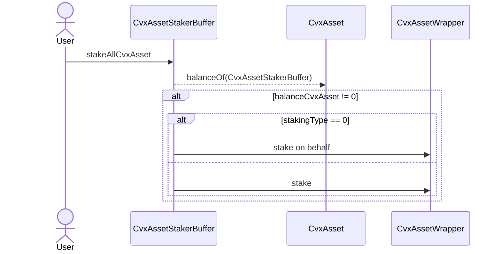

# CvxAssetStakerBuffer

## Description

This contracts aims to accumulate and stake all `cvxAsset` received through the associated `CvxAssetStakingService` contract.
It also claims and process rewards for stakers.

## withdraw

Function to withdraw an amount of either `cvxAsset` or `stkCvxAsset`.
It is only callable through the `withdraw` function of the associated staking contract.

## pullRewards

Function to process Convex rewards for the previous cycle.
It is only callable by the associated staking contract.

## stakeAllCvxAsset

Function to stake all pending `cvxAsset` on this contract.
Anyone can call this function.

