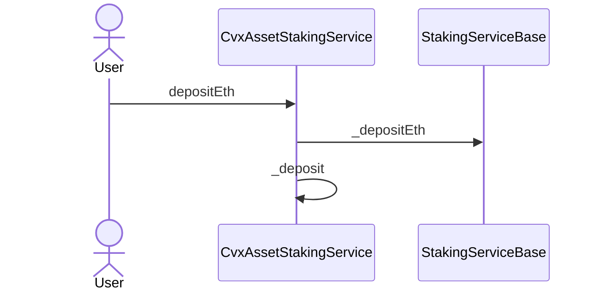
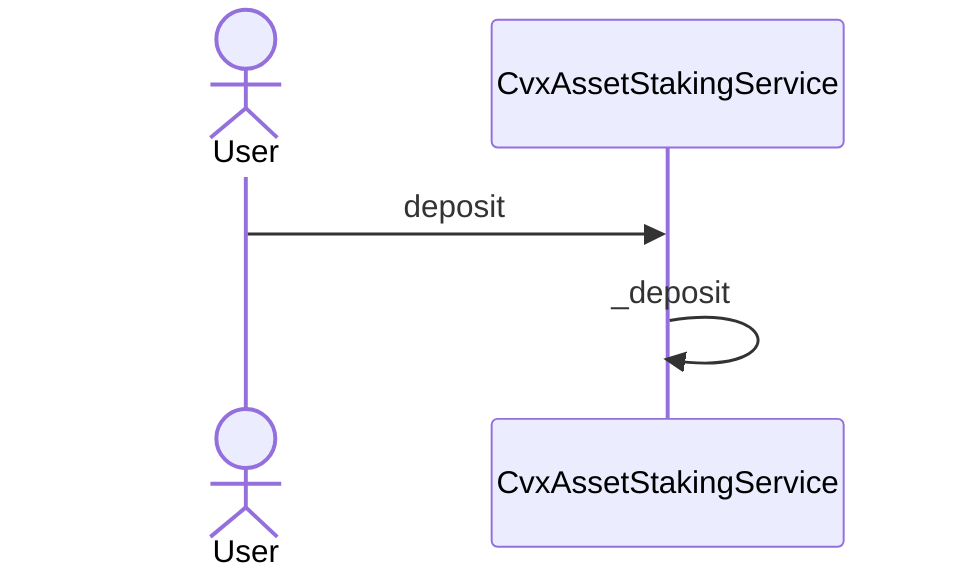
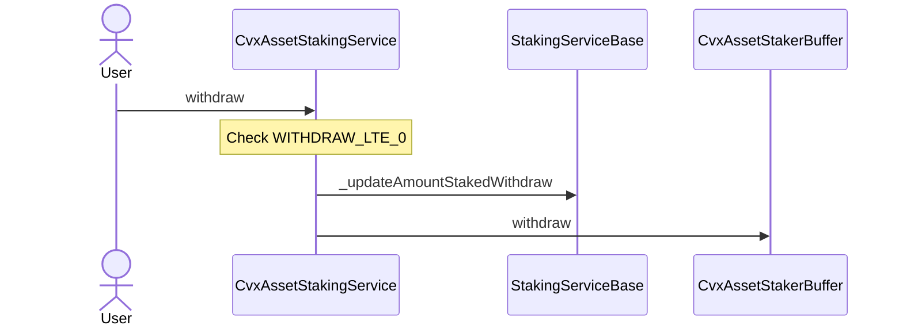
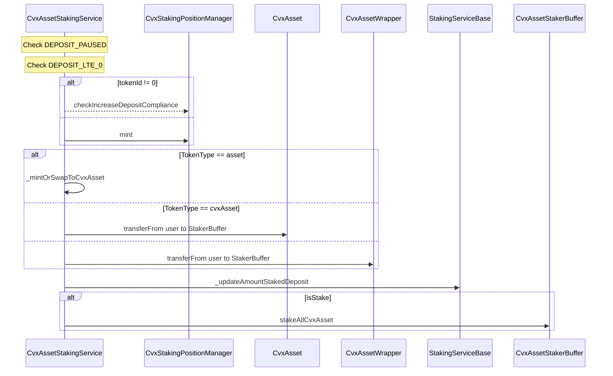
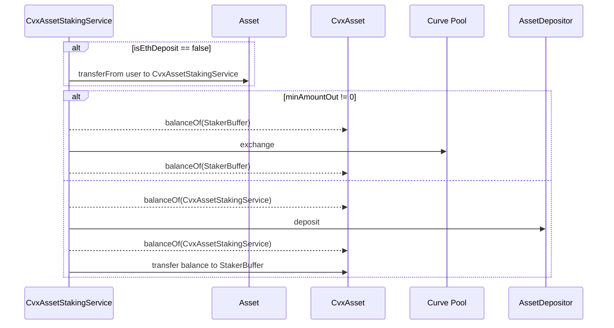

# CvxAssetStakingService

## Description

This contract is in charge of registering deposits and withdraws of staking position. It inherits from the `StakingServiceBase` which implements all the staking logic.
Staking positions are represented by a unique NFT.

Any user can own a staking position by depositing ETH, `cvxAsset` or `stkCvxAsset`. Reducing the entry barrier.

### Note

Votes must be disabled during the first cycle of deployment to prevent the burning of inflation as 0 token will be staked fully during 1 cycle on the first cycle. Also, processing CVX rewards is not enabled at the first cvgCycle of the deployment.

## depositEth

It issues an NFT **Staking Position** or increase the staked amount on an already existing one.
User deposits ETH on the contract, which are automatically swapped to `cvxAsset` and then staked.
The main process is written inside the internal `_deposit` function which is detailed below.

## deposit

It issues an NFT **Staking Position** or increase the staked amount on an already existing one.
User has the ability to choose which token to deposit between these three:
- Asset
- cvxAsset
- stkCvxAsset

## withdraw

- Removing rewards before the end of a cycle leads to the loss of all rewards accumulated during this cycle.
- Withdrawing always removes first from the staked asset deposited on the same cycle (pending staked) then on the staked amount eligible to rewards (on the current cycle).

## _deposit

Internal function covering the staking logic of `cvxAsset`.

## _mintOrSwapToCvxAsset

Internal function to mint or swap `Asset` to `cvxAsset`.

