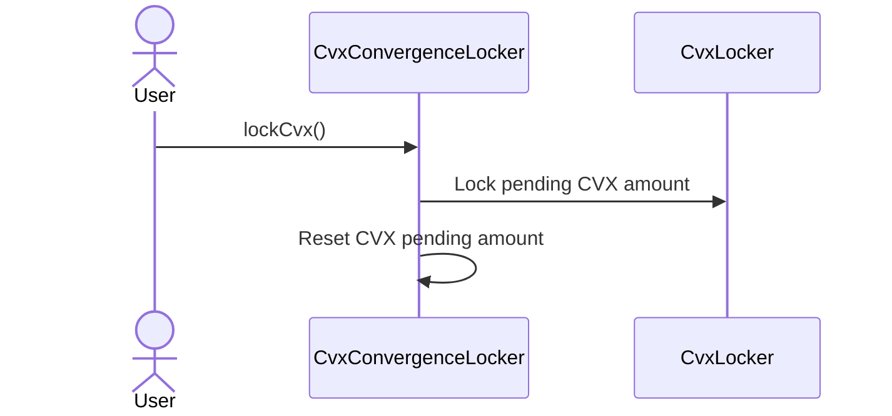
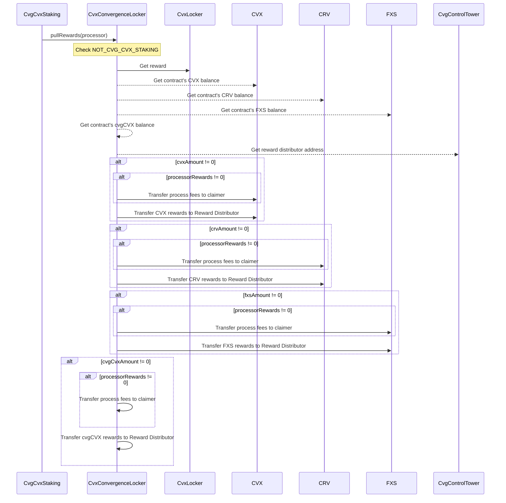
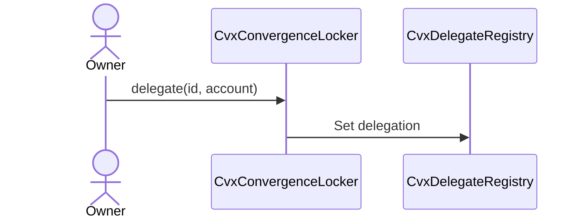
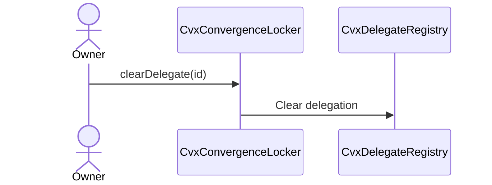
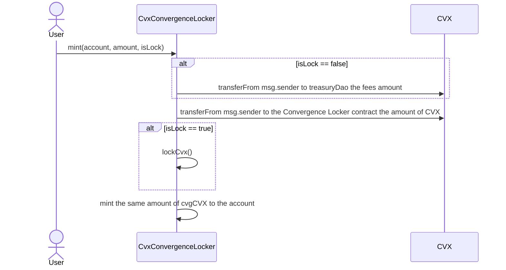
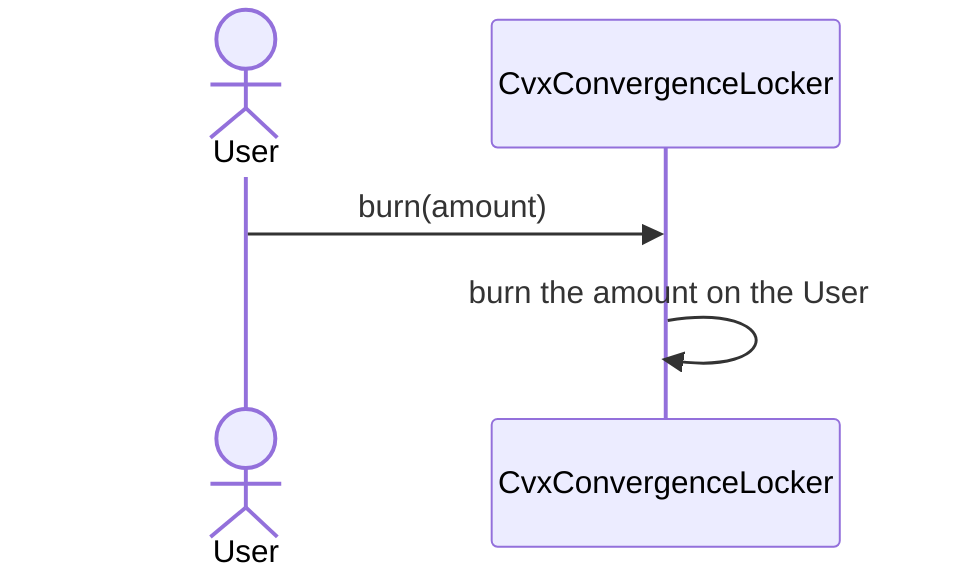
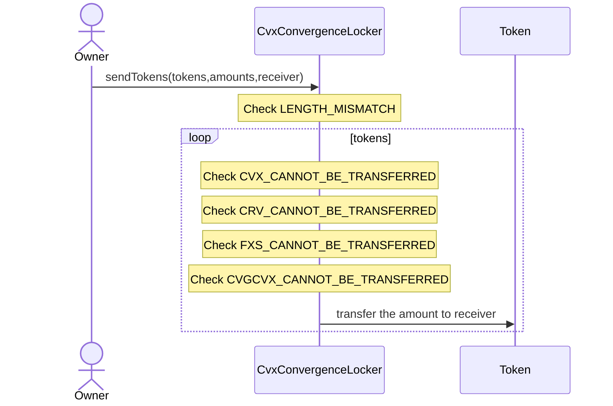
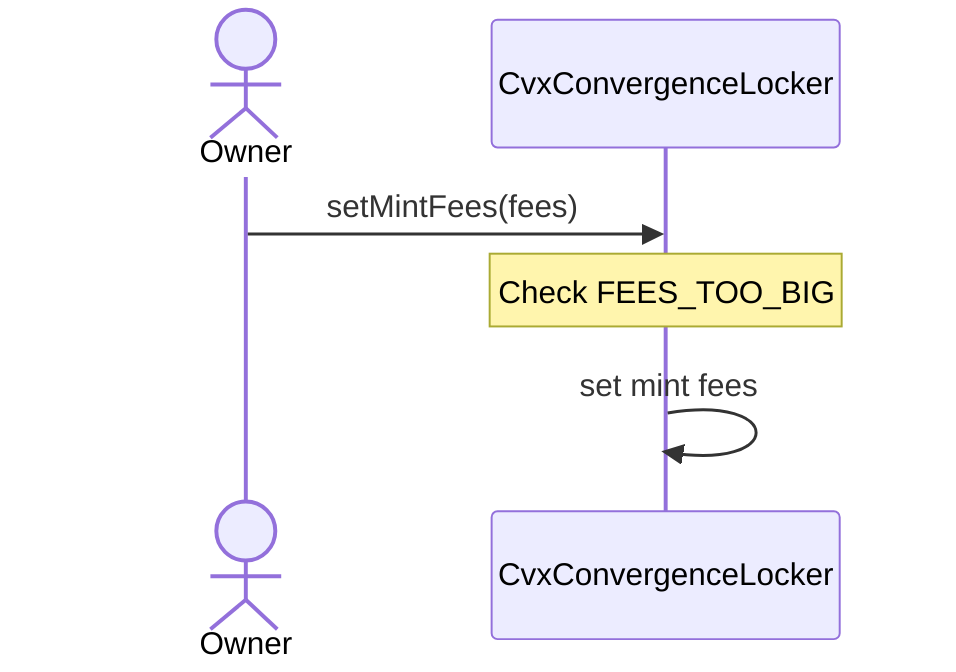
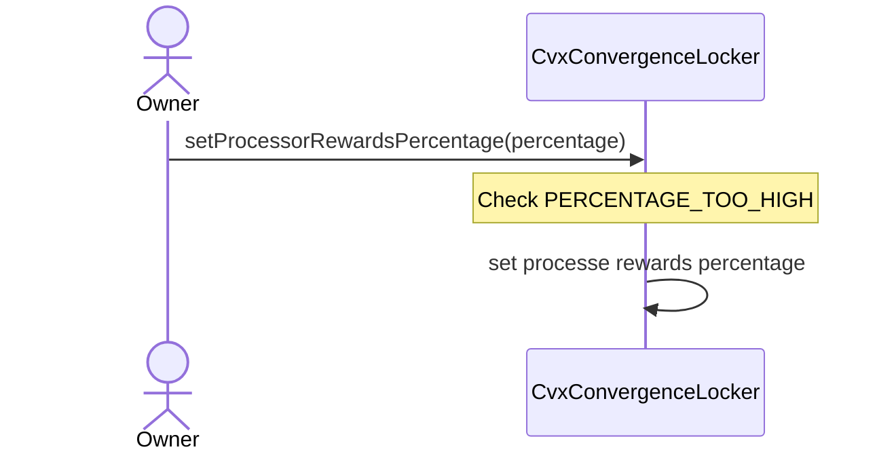

# CvxConvergenceLocker

## Description

This contract aims to cover 3 features of the Convex integration on Convergence.
First one is the ERC20 integration of our cvgCVX token which acts as a liquid locker of vlCVX, which means that having 1 cvgCVX is the same as having 1 vlCVX.
The advantage of a liquid locker is that it's exchangeable, conversely to the vl token which is not.
An associated stable pool will allow stakers to retrieve their CVX tokens at almost 1:1 ratio depending on the peg of the pool.

The second goal of this contract is to lock the CVX tokens received during the minting of cvgCVX tokens into vlCVX.

Then, it acts as a Buffer to pull rewards earned through locking CVX tokens.
Rewards are these four tokens: CVX, CRV, FXS and cvgCVX coming from these sources:
- Native rewards in CVX
- Bribe rewards coming from the MultiMerkleStash of [Votium](https://votium.app/).

### lockCvx

Anyone is able to call this function.

### pullRewards

This method is called by the cvgCVX staking contract to pull the rewards into the Reward Distributor contract.
This process is encouraged so the user who triggers it through the staking contract receives rewards.

### delegate

Delegates the voting power earned through vlCVX tokens to another address.
It will be a multisig owned by Convergence and team members of Convex (TO CONFIRM ?).

Parameter `id` represents the ENS name of the Snapshot we want to delegate to.

### clearDelegate

Clears the delegation previously set.

### mint

Mint cvgCVX tokens.

### burn

### sendTokens

Method used to transfer multiple tokens on the contract to a receiver.
Tokens must not be CVX, CRV, FXS nor cvgCVX for fairness because these are reward tokens.

### setMintFees

This function sets a new fees amount when users mint cvgCVX without locking their CVX.
The maximum fees amount is 2% (200).
It is only callable by the Treasury DAO multisig.

### setProcessorRewardsPercentage

This function sets the percentage of rewards to send to the address who processed the rewards as an incentive.
The maximum amount is 3% (3000).
It is only callable by the Treasury DAO multisig.

